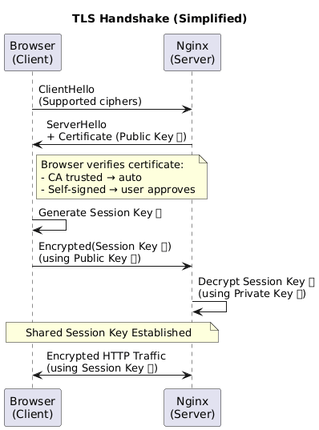
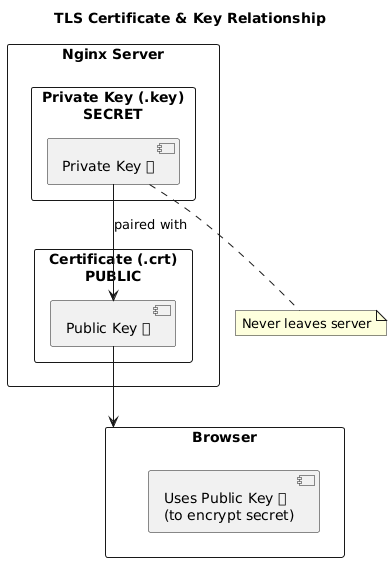

# Ingress (Nginx Reverse Proxy + TLS)

The `ingress` package is the external entry point for platform services on the shared Docker `platform` network.

## Architecture

```text
Client (Browser/API)
      |
      | HTTPS 443 (TLS termination at Nginx)
      |
 +----------------+
 | nginx-ingress  |
 +--------+-------+
          |
          | Docker network: platform
          |
   +-------------+     +----------------+
   | grafana:3000|     | prometheus:9090|
   +-------------+     +----------------+
```

Current virtual hosts:
- `grafana.local` -> `http://grafana:3000`
- `prometheus.local` -> `http://prometheus:9090`

## Repository Layout

- `docker-compose.yml`: ingress service definition and published ports
- `nginx/nginx.conf`: global Nginx configuration
- `nginx/conf.d/*.conf`: per-service vhost routing
- `nginx/certs/`: TLS certificate and private key mounted read-only into Nginx

## Security Model


- Only ingress should publish external ports (`80`, `443`)
- Backends should stay private on the `platform` Docker network
- TLS is terminated at Nginx using `nginx/certs/homelab.crt` and `nginx/certs/homelab.key`
- Standard proxy headers are forwarded (`Host`, `X-Real-IP`, `X-Forwarded-For`, `X-Forwarded-Proto`)

Note:
- This setup currently uses a self-signed certificate and is appropriate for LAN/internal use.
- If any backend package publishes host ports directly (for example database ports), that bypasses ingress controls and should be treated as an exception.

## Local DNS / Hosts Mapping

Clients must resolve ingress hostnames to your server IP.

Example `/etc/hosts`:

```text
<server-ip> grafana.local
<server-ip> prometheus.local
```

## Run

Check certificate presented by ingress:

```bash
openssl s_client -connect grafana.local:443 -servername grafana.local </dev/null
```

HTTP checks (ignore cert trust with `-k` for self-signed certs):

```bash
curl -kI https://grafana.local
curl -kI https://prometheus.local
```

## Add a New Service Route

1. Create `nginx/conf.d/<service>.conf`:
    ```nginx
    server {
        listen 443 ssl;
        server_name <service>.local;
    
        ssl_certificate     /etc/nginx/certs/homelab.crt;
        ssl_certificate_key /etc/nginx/certs/homelab.key;
    
        location / {
            proxy_pass http://<docker-service-name>:<port>;
            proxy_set_header Host $host;
            proxy_set_header X-Real-IP $remote_addr;
            proxy_set_header X-Forwarded-For $proxy_add_x_forwarded_for;
            proxy_set_header X-Forwarded-Proto https;
        }
    }
    ```
2. Add DNS/hosts entry for `<service>.local`.
3. Validate and restart ingress.

